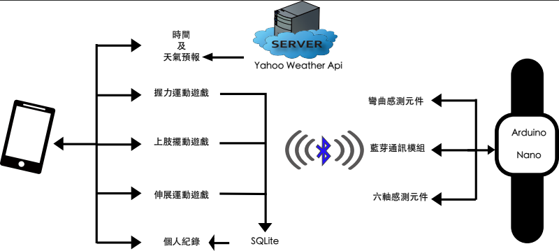
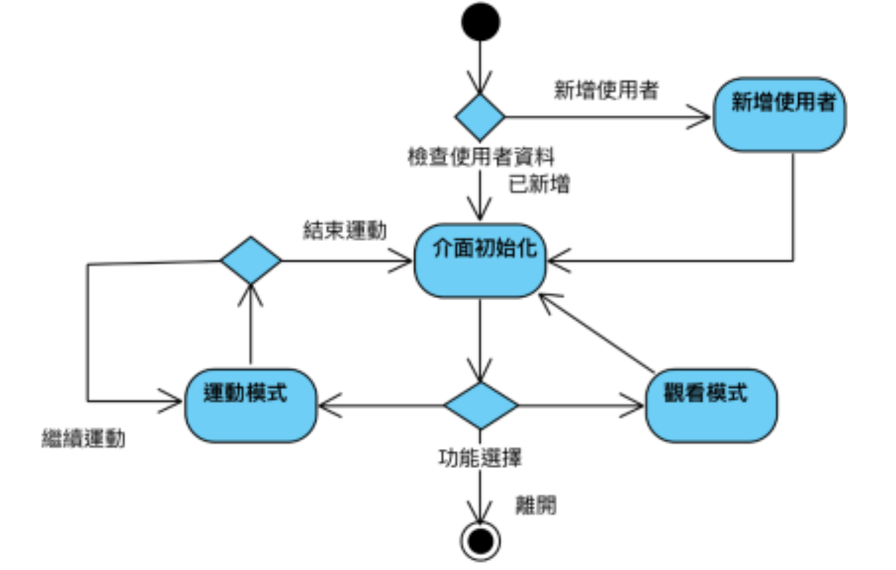

# HandTrainSystem

針對高齡者設計上肢訓練遊戲有握力運動、上肢擺動、伸展運 動三款遊戲，透過藍芽與### [**穿戴式裝置**](https://github.com/percyku/MyTrainningSystem/tree/master) 進行連線操作，

並透過 Android系統裡的SQLite進行數據的紀錄，提供給使用者個人紀錄觀看介面，還有Google語音，給予提示引導使用者進行操作。

此外，也結合手機內建的時間功能和 Yahoo Weather API 提供的天氣預報，給予高齡者貼心的提醒。

# 系統架構圖

  

# 系統流程圖

  

