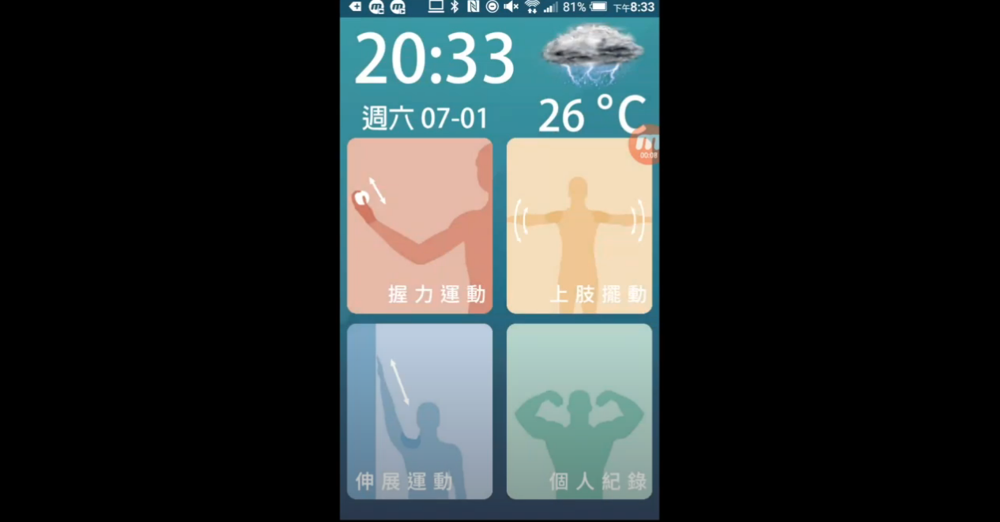
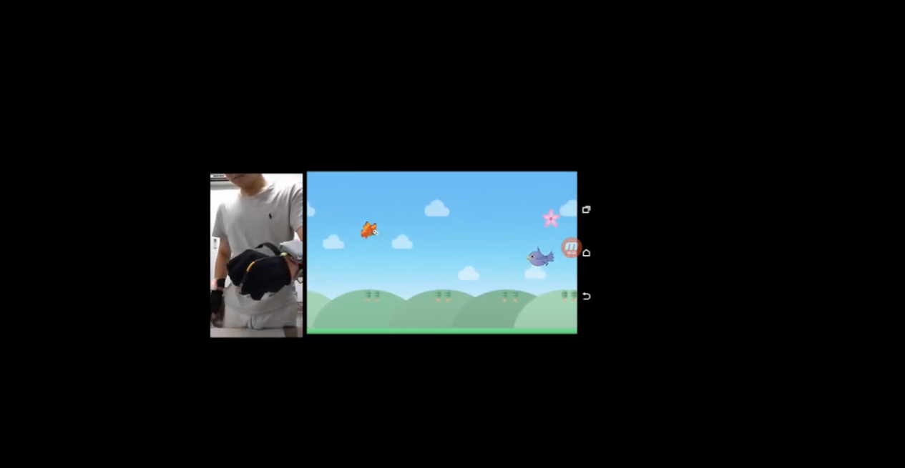
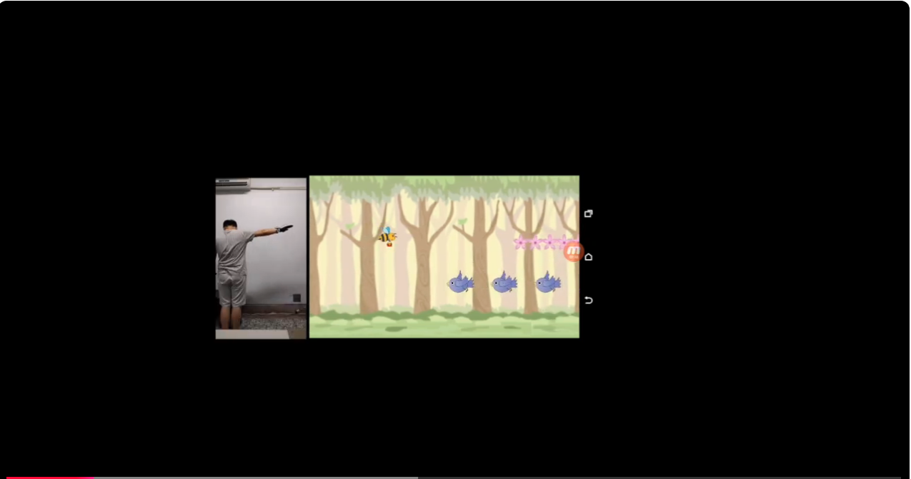
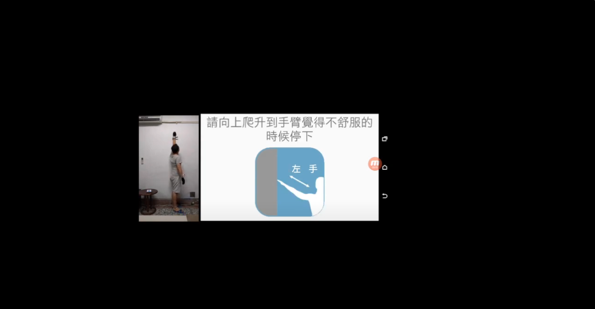

# HandTrainSystem

此App針對高齡者設計上肢訓練遊戲有握力運動、上肢擺動、伸展運動三款遊戲，透過藍芽與[**穿戴式裝置**](https://github.com/percyku/MyTrainningSystem/tree/master)連線操作。

另外運用Google語音，提示引導使用者進行操作，最後使用SQLite進行數據的紀錄，提供觀看個人紀錄頁面。

此外，也結合手機內建的時間功能和 Yahoo Weather API 提供的天氣預報。

# 開發工具與程式語言

- Android Studio
- Java

# 系統架構圖

  

# 系統流程圖

  

# 影片操作

  - 藍牙連線

    

  - 握力運動

    

  - 上肢擺動
    
    

  - 伸展運動

    

# 備註

  - 此應用程式應用在 [結合個人化健康傳播之遊戲式上肢訓練系統實作](https://ndltd.ncl.edu.tw/cgi-bin/gs32/gsweb.cgi/login?o=dnclcdr&s=id=%22105NTPT0787030%22.&searchmode=basic) 的碩士論文
  - 需搭配 [穿戴裝置](https://github.com/percyku/MyTrainningSystem) 進行連線操作
  - 於2017創建，因為年久失修，會與當前Android 版本不相容